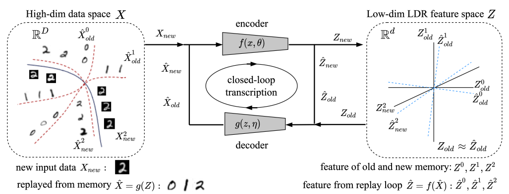

# Incremental Learning of Structured Memory via Closed-Loop Transcription

[](https://arxiv.org/abs/2202.05411)





Shengbang Tong, Xili Dai, Ziyang Wu, Mingyang Li, Brent Yi, Yi Ma

## Introduction
This repository contains the implementation for the paper "Incremental Learning of Structured Memory via Closed-Loop Transcription". This work proposes a minimal computational model for learning structured memories of multiple object classes in an incremental setting. Our approach is based on establishing a closed-loop transcription between the classes and a corresponding set of subspaces, known as a linear discriminative representation, in a low-dimensional feature space. Network parameters are optimized simultaneously without architectural manipulations, by solving a constrained minimax game between the encoding and decoding maps over a single rate reduction-based objective. Experimental results show that our method can effectively alleviate catastrophic forgetting, achieving significantly better performance than prior work of generative replay on MNIST, CIFAR-10, and ImageNet-50, despite requiring fewer resources.

## Getting Started
Current code implementation supports MNIST and cifar10. We will update more datasets in the near future~

To get started with the i-CTRL implementation, follow these instructions:

### 1. Clone this repository
```bash
git clone https://github.com/tsb0601/i-CTRL.git
cd i-CTRL
``` 
### 2. Install required packages
```
pip install -r requirements.txt
```

### 3. Configuration

The model and training configurations are as follows:

- `PCACOMP`: Number of principal components for PCA in nearsub evaluation (default = 15)
- `SAMPLE_N`: Number of sample classes (default = 12)
- `SAMPLE_K`: Number of samples per class (default = 40)
- `LAMBD`: Lambda parameter for reviewing (default = 10)
- `LRG`: Learning rate for generator (default = 0.0001)
- `LRD`: Learning rate for discriminator (default = 0.0001)
- `EPOCHS`: Training Epochs per Incremental Task (default = 100)

### 4. Training
If you want to MNIST, please use:
```
python main.py --cfg experiments/cifar10.yaml
```
If you want to CIFAR-10, please use:
```
python main.py --cfg experiments/mnist.yaml
```


## Acknowledgment
This repo is inspired by [MCR2](https://github.com/Ma-Lab-Berkeley/MCR2), [EMP-SSL](https://github.com/tsb0601/EMP-SSL) and [CTRL](https://github.com/Delay-Xili/LDR) repo.

## Citation
If you find this repository useful, please consider giving a star :star: and citation:

```
@article{tong2022incremental,
  title={Incremental learning of structured memory via closed-loop transcription},
  author={Tong, Shengbang and Dai, Xili and Wu, Ziyang and Li, Mingyang and Yi, Brent and Ma, Yi},
  journal={arXiv preprint arXiv:2202.05411},
  year={2022}
}
```